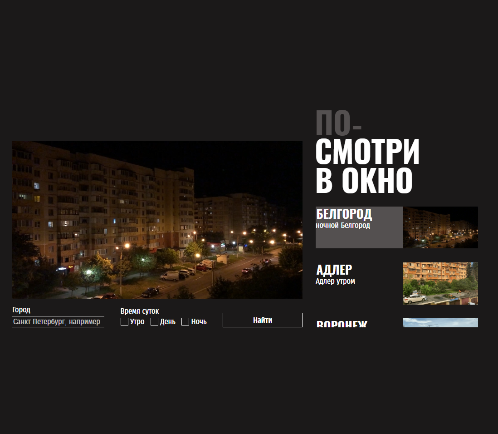

# Яндекс Практикум, проект "Оно тебе надо"

## Оглавление

- [Скриншот](#скриншот)
- [Макет](#макет)
- [Ссылки](#ссылки)
- [Автор](#автор)

### Скриншот

### Макет

- Макет задания: [Figma](https://www.figma.com/file/QHcvX1RsUI89CulRB7HLk6/%234-Посмотри-в-окно?type=design&node-id=301-98&mode=design&t=8o6En6uxDc2DuKuc-0)

### Ссылки

- URL решения: [Github](https://github.com/lev1996frontend/posmotri_v_okno)
- URL лайв сервера: [Github](https://lev1996frontend.github.io/posmotri_v_okno/)

## Автор

- Github - [lev1996frontend](https://github.com/lev1996frontend)
